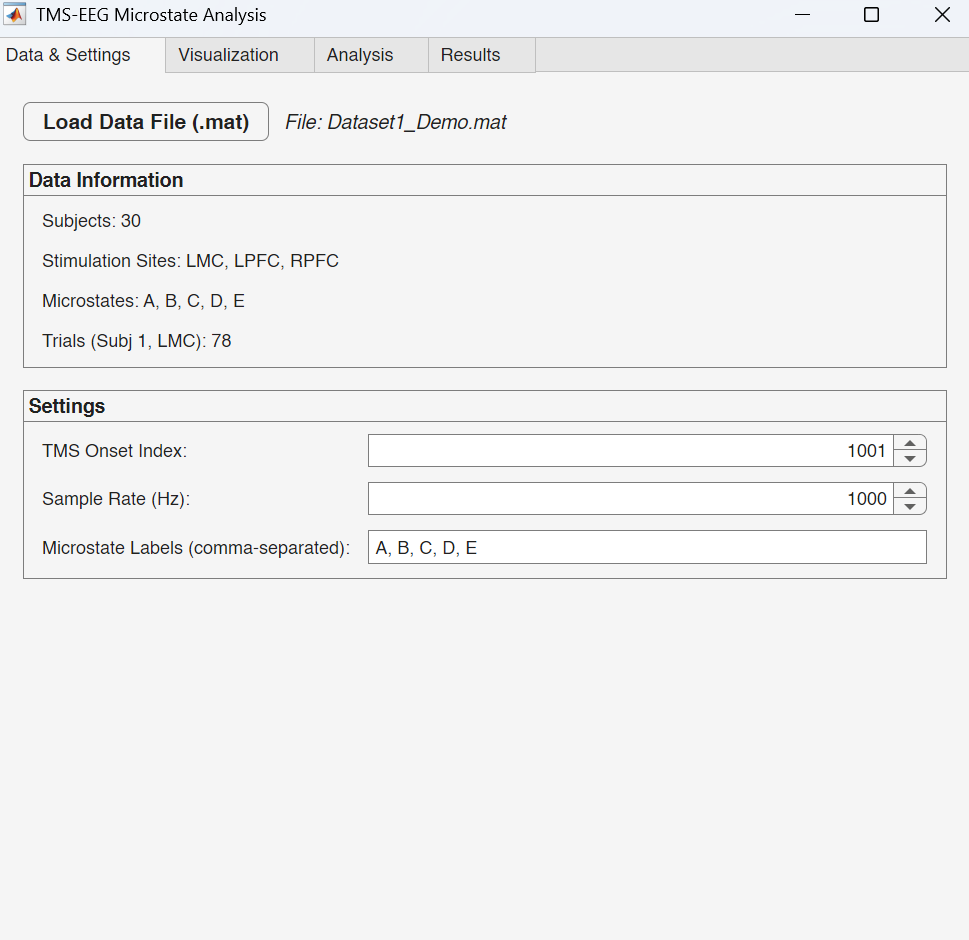
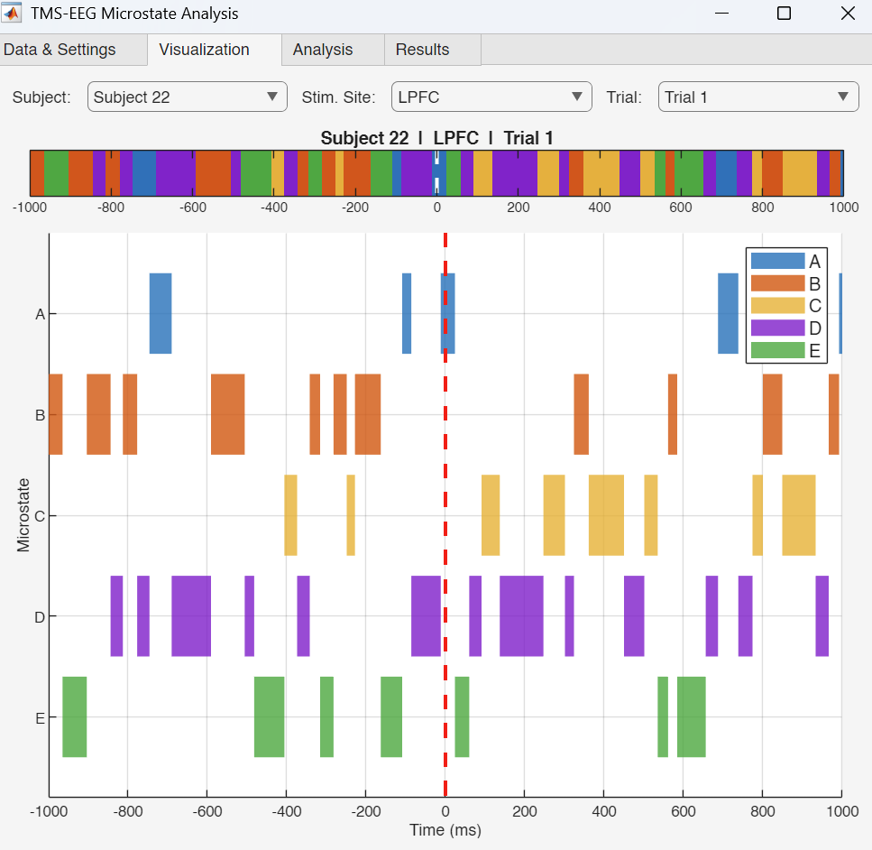
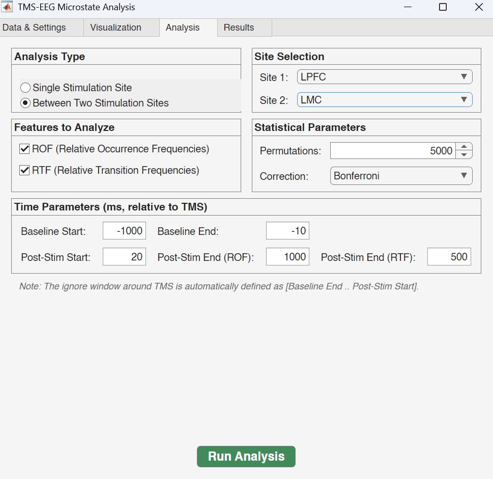
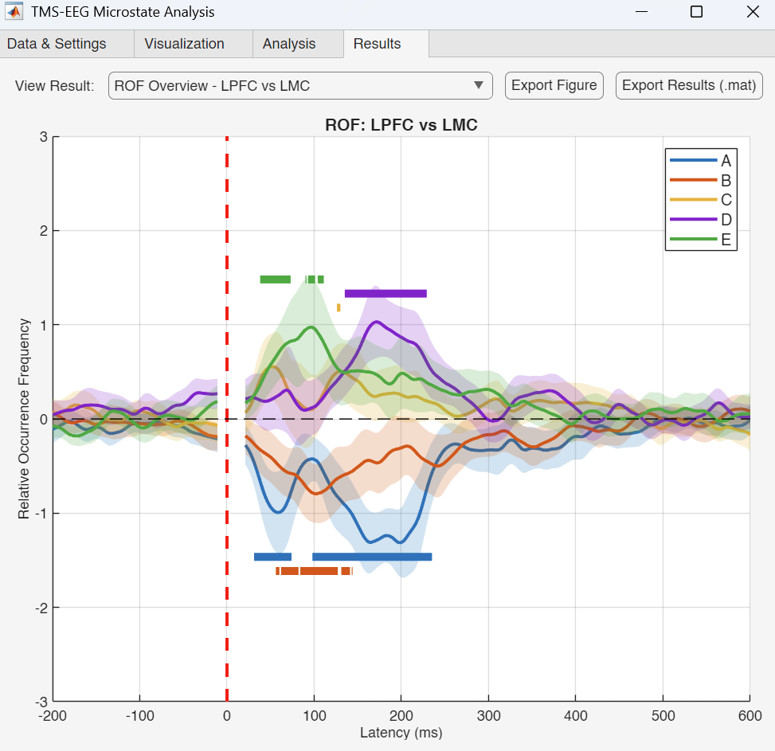

# TMS-EEG Microstates

**This repository provides the supporting code and analysis pipeline for the results presented in the paper: *"Insight into the Impact of Focal Stimulation on Large-Scale Network Dynamics"*.**

---

## Overview

This MATLAB toolbox implements a complete analysis pipeline for investigating how transcranial magnetic stimulation (TMS) affects EEG microstate dynamics.

The toolbox supports two types of analysis:

- **Single-site analysis** — Assess how TMS delivered to a given stimulation site changes the relative occurrence frequency of each microstate in the post-pulse period compared to a pre-pulse baseline, across subjects over time, using Threshold-Free Cluster Enhancement (TFCE) with permutation testing.
- **Between-site comparison** — Compare these baseline-corrected post-pulse effects between two different stimulation sites (e.g., left DLPFC vs. left M1) using paired permutation testing, to identify site-specific differences in how focal stimulation influences global brain state dynamics.

In both cases, state-to-state **transition probabilities** (post-pulse vs. pre-pulse baseline) are also analyzed using t-tests with multiple comparison correction (Bonferroni/FDR).

## Main Functions

| Function | Description |
|----------|-------------|
| `run_analysis.m` | Command-line script that runs the full analysis pipeline — extracts microstate frequencies, performs statistical testing (TFCE), and generates publication-ready figures. |
| `TMS_EEG_Microstates_App.m` | Interactive MATLAB App with a graphical interface for loading data, visualizing microstate sequences, configuring analysis parameters, and exploring results — no code editing required. |

## App Walkthrough

The app has four tabs that guide you through the full workflow:

### 1. Data & Settings

Start by clicking **Load Data File (.mat)** to import your dataset. The app automatically detects and displays:
- Number of subjects
- Available stimulation sites (e.g., LMC, LPFC, RPFC)
- Microstate labels (e.g., A, B, C, D, E)
- Number of trials per subject/site

You can also adjust the **TMS onset index**, **sample rate**, and **microstate labels** to match your data.



### 2. Visualization

Explore the raw microstate sequences on a trial-by-trial basis. Use the dropdown menus to select any **subject**, **stimulation site**, and **trial number**:
- The **top color strip** shows the full microstate label sequence across time
- The **lower plot** displays each microstate on its own row, showing when it is active
- The **red dashed line** marks the TMS pulse onset (time = 0 ms)

This view helps verify data quality and observe microstate dynamics around the TMS pulse for individual trials.



### 3. Analysis

Set up and launch the statistical analysis:
- **Analysis Type** — Choose *Single Stimulation Site* (post-pulse vs. baseline) or *Between Two Stimulation Sites* (paired comparison)
- **Site Selection** — Pick the stimulation site(s) to analyze
- **Features to Analyze** — Check ROF (Relative Occurrence Frequencies), RTF (Relative Transition Frequencies), or both
- **Statistical Parameters** — Set the number of permutations (e.g., 5000) and the correction method (Bonferroni or FDR)
- **Time Parameters** — Define the baseline window (e.g., -1000 to -10 ms) and post-stimulation test window (e.g., 20 to 1000 ms)

Click the green **Run Analysis** button to start. A progress bar tracks the permutation testing.



### 4. Results

Once the analysis completes, results are displayed in the **Results** tab:
- **ROF curves** show baseline-corrected relative occurrence frequencies for each microstate over time, with **shaded 95% confidence intervals**
- **Colored horizontal bars** above and below the curves highlight statistically significant time periods (p < 0.05, TFCE-corrected)
- **Click on any significance bar** to view the **effect size (Cohen's d)** for that cluster
- Use the **dropdown menu** to switch between different result views (e.g., ROF overview, individual microstates, or different site comparisons)
- Click **Export Figure** to save the current plot, or **Export Results (.mat)** to save the full statistical output



## Data Format

Place your data files in the `data/` directory with the naming convention:

```
data/[Dataset]_[Visit].mat
```

Each `.mat` file must contain a variable called `data_struct` — a **1 x N structure array** (one element per subject) with the following structure:

```
data_struct(subject)
│
└── microstate_data              % struct with one field per stimulation site
    │
    ├── lpfc                     % cell array {1 x nTrials}
    │   ├── {1} = ["B","B","D","A", ...]   % 1 x 2001 microstate labels (trial 1)
    │   ├── {2} = ["A","C","C","E", ...]   % 1 x 2001 microstate labels (trial 2)
    │   └── ...
    │
    ├── rpfc                     % cell array {1 x nTrials}
    │   ├── {1} = ["C","C","A","B", ...]
    │   └── ...
    │
    └── lmc                      % cell array {1 x nTrials}
        ├── {1} = ["D","E","E","A", ...]
        └── ...
```

- Each **subject** is one element of the `data_struct` array (e.g., `data_struct(1)`, `data_struct(2)`, ...)
- Each **stimulation site** (e.g., `lpfc`, `rpfc`, `lmc`) is a field under `microstate_data`
- Each site contains a **cell array of trials**, where each trial is a **1 x T vector** of microstate labels (strings matching the labels defined in settings, e.g., `"A"`, `"B"`, `"C"`, `"D"`, `"E"`)
- **T** corresponds to the number of time points (e.g., 2001 for a -1000 to +1000 ms epoch at 1000 Hz)

## Citation

If you use this code in your research, please cite:

> Kabir, A., Dhami, P., Chatterjee, R., Blumberger, D.M., Daskalakis, Z.J., Moreno, S. and Farzan, F. *Insight into the Impact of Focal Stimulation on Large-Scale Network Dynamics*. [Journal of Neural Engineering], [2026]. DOI: [https://doi.org/10.1088/1741-2552/ae4a4f]
